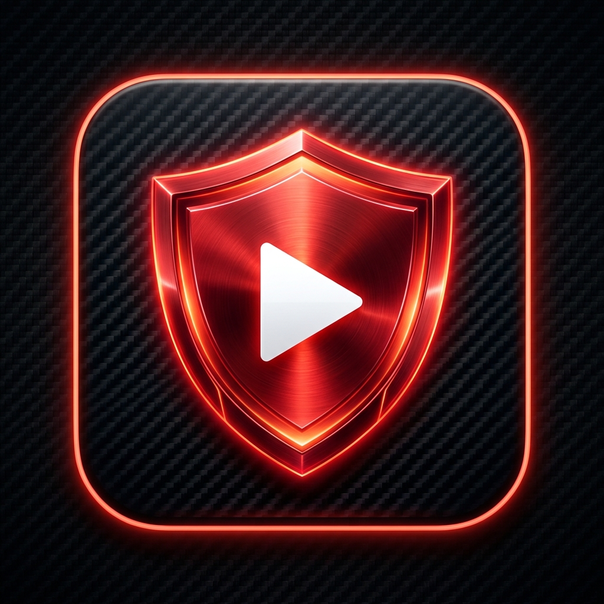

# TubeShield - YouTube AdBlock & Background Player for iOS 18

> **TubeShield** is a native iOS application built with SwiftUI and WebKit, providing a clean, ad-free YouTube experience on iOS 18 and iOS 17.

## Features
- **100% Ad-Free**: Blocks and instant-skips pre-roll, mid-roll video ads, banner ads, and suggested sponsored videos.
- **Background Audio Playback**: Keep listening to music/podcasts with the screen locked or while using other apps.
- **Lock Screen & Dynamic Island Controls**: Real-time video artwork, title, channel name, scrubbing, and play/pause controls.
- **SponsorBlock**: Automatically detects and jumps over embedded sponsored segments.
- **Picture-in-Picture (PiP)**: Smooth floating window when returning to the home screen.
- **Free GitHub Actions Build Pipeline**: Automatically compiles the app into an `.ipa` package for easy sideloading from Windows.

## Quick Installation Guide
Please see [HUONG_DAN_CAI_DAT.md](HUONG_DAN_CAI_DAT.md) for detailed step-by-step instructions in Vietnamese.
